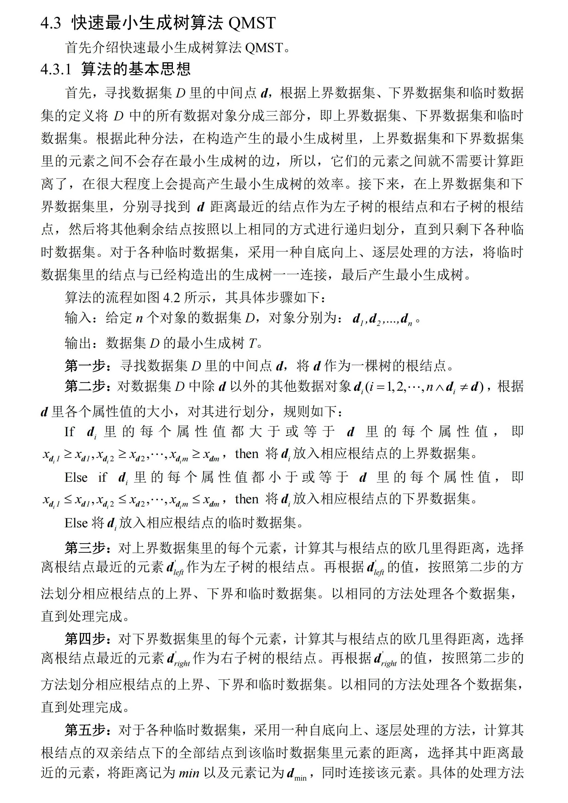
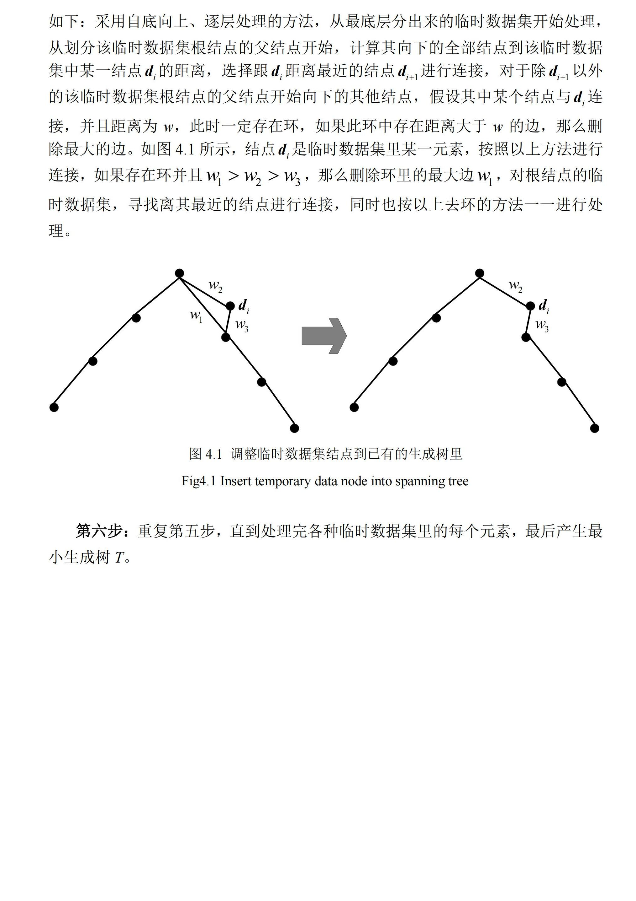

# 一种朴素的完全图最小生成树构建方法

## 1.闲谈
算法的思想来源于我在某文献中看到的一个小算法，如下图所示。

---
&emsp;&emsp;乍一看是不是觉得很有道理？其实细细一想，就会发现它所描述的算法的本质就是“破圈法”，其时间复杂度高达O(n3)。
尽管它运用分治法的思想来减少了计算量，但所耗费的时间仍然是巨大的。其主要缺陷在于每次添加边都需要检查两个节点是否连通，
如果连通还需找出路径上的最大边并删除。寻找路径上最大边的过程需要使用BFS或DFS等遍历算法，时间复杂度为O(n)。
&emsp;&emsp;而且在处理临时区域节点时，会将当前节点与区域内所有节点进行连接，这个过程的时间复杂度为O(mt),其中m是临时区域节点数，t是当前区域下的节点数。
需要处理的临时区域数量与初始树的深度有关，因此总复杂度为O(dmt)，其中d是初始树的深度。简单分析，就会发现，d=O(n),m,t均为与n相关的函数。
因此，整体时间复杂度为O(n3)，这并不“快速”。  
&emsp;&emsp;此外，我尝试过使用Link-Cut Tree等数据结构来优化该算法，但由于其本质仍然是“破圈法”，其时间复杂度也为O(n2 log n)。
既然如此，为什么不直接使用Kruskal算法或Prim算法来构建最小生成树呢？对于完全图Kruskal算法的时间复杂度为O(n2 log n)，而Prim算法的时间复杂度为O(n2)。
且Link-Cut Tree虽然各个操作的时间复杂度为O(log n)，但是其常数因子较大，只在超大型图中才有优势。

---
## 2.算法简要描述
&emsp;&emsp;我保留了原有的分治思想，但对其进行了优化，首先对点集的分布进行分析，选取一条直线，点集上点的分布大致与直线延展方向一致。
根据直线的方向向量确定在每个维度上的划分，正分量则为大于等于，负分量则为小于等于。这样更加合理，可以减少临时点的数量。
其次，算法摒弃逐步加入边并删除环路中最大边的“破圈”思想，改为将所有候选边收集起来，最后统一使用kruskal算法来生成最小边。
为了减少候选边的数量，在每次尝试连接边时，会检查以两点为直径的圆中是否有其他节点，如果有，则不添加该边(这也是Gabriel图的条件)。
本质就是在类似Gabriel图的结构上构建MST。

## 3.项目文件

### 核心文件
- `OptimizedMST.py`: 实现了优化版本的最小生成树构建算法
- `PyDisjointSet.py`: 实现了并查集数据结构，用于Kruskal算法中的连通性判断
- `obsolete`
  - `lct_mode`:Link-Cut Tree的C++实现（已弃用） 
  - `PyLinkCutTree.py`: Link-Cut Tree的Python端接口封装（已弃用）
  - `LinkCutTree.py`: Link-Cut Tree的Python实现（已弃用）
- `main.py`: 主程序入口，包含示例代码和可视化

### 类说明
1. **MSTBuilder** (OptimizedMST.py)
   - 核心算法实现类
   - 包含点集分析、候选边收集和MST构建等功能
   - 支持结果可视化

2. **DisjointSet** (PyDisjointSet.py)
   - 并查集数据结构实现
   - 支持动态合并和查找操作
   - 使用路径压缩和按秩合并优化

### 依赖项
- numpy: 用于数值计算和数组操作
- scipy: 用于空间数据处理和几何计算
- networkx: 用于绘制MST
- matplotlib: 用于结果可视化
- typing: 用于类型注解

